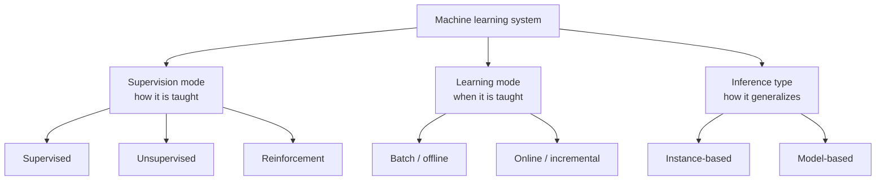
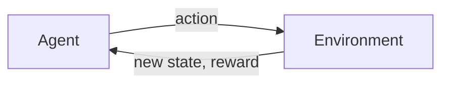
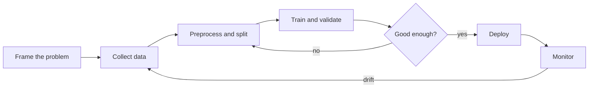

Machine learning is usually introduced as a list of algorithms. That is the wrong place to start. Algorithms are easy to look up. What is harder, and what actually decides whether a project works, is knowing what kind of problem you have, what kind of system fits it, and what tends to go wrong along the way.

This post covers that foundation. It is the first in a series that builds toward designing and training models for real problems.

<!-- prettier-ignore-start -->

> **The Three Questions**
>
> How is the system taught, when is it taught, and how does it generalize
> to things it has not seen? Everything below is an answer to one of those three.
{: .block-tip }

<!-- prettier-ignore-end -->

---

## Types of Machine Learning

There are three main categories of machine learning systems:

- **Supervision modes**: supervised, unsupervised, and reinforcement learning
- **Learning modes**: online learning and batch learning
- **Inference types**: instance-based and model-based learning

These categories are not mutually exclusive and can be combined according to the needs of the problem.



The three axes are independent. You pick one option from each, and the combination describes the system far better than the name of the algorithm does.

### Example

A self-driving car might use a machine learning system that employs supervised learning, learns through batch learning, and reasons through a statistical model that enables short-term predictions, such as detecting that the car ahead is braking and the system needs to activate the brakes soon.

Placed on the three axes, that system is:

| Axis           | Choice      | Why                                                                    |
| -------------- | ----------- | ---------------------------------------------------------------------- |
| Supervision    | Supervised  | Training clips are labeled with "braking" or "not braking"             |
| Learning mode  | Batch       | Retraining a driving model in production, on the fly, would be unsafe  |
| Inference type | Model-based | The car cannot carry its entire training set and search it at 120 km/h |

---

## Supervised Learning

The most common learning mode is supervised learning. This means training the system with data that contains the desired solution. These solutions are called **labels**.

An example of labeled data could be an image of a car, which is the input data, and its assigned car model, which is the label. After a machine learning system is trained on data and labels, it can take a new image and output its predicted label. The metrics used to measure the system's ability to assign correct labels vary by problem, and they are just as important as the training process itself.

In code, this shape is always the same: a matrix of inputs, a vector of labels, and a `fit` call.

```python
from sklearn.linear_model import LogisticRegression

# X_train: one row per sample, one column per feature
# y_train: the label we want the model to learn to predict
model = LogisticRegression()
model.fit(X_train, y_train)

predictions = model.predict(X_test)
```

The two most common tasks addressed with supervised learning are **classification** and **regression**.

### Classification

A classification problem assigns a discrete label to a new input. This can be a numerical value or a category, such as deciding whether a given image represents a dog or a cat. In either case, the answer belongs to a well-defined set of options. Properly defining those options can significantly affect model performance.

Training a classifier means minimizing a loss that punishes confident wrong answers. The usual choice is cross-entropy:

$$
L = -\frac{1}{n} \sum_{i=1}^{n} \sum_{c=1}^{C} y_{i,c} \log(\hat{y}_{i,c})
$$

<!-- prettier-ignore -->
Here $$ y_{i,c} $$ is 1 when sample $$ i $$ truly belongs to class $$ c $$ and 0 otherwise, and $$ \hat{y}_{i,c} $$ is the probability the model assigned to that class. Notice what the logarithm does: being confidently wrong costs far more than being uncertain.

### Regression

A regression problem assigns a continuous value to new data. For example, a model might predict the price of a house from features such as the number of rooms, size in square meters, and number of bathrooms. In this case, the output belongs to a continuous range rather than a finite set.

The corresponding loss measures distance rather than surprise. Mean squared error is the standard starting point:

$$
\text{MSE} = \frac{1}{n} \sum_{i=1}^{n} (y_i - \hat{y}_i)^2
$$

Squaring makes large mistakes dominate the total, which is useful when big errors are genuinely worse, and harmful when your data contains outliers you do not care about. Mean absolute error is the common alternative when outliers should not steer training.

Supervised learning requires a significant amount of labeled data for the model to learn effectively.

The classic example is a model trained on thousands of cat and dog images that learns to classify new photos into one of these two categories. Classification models can learn to distinguish any number of classes, as long as they have a representative dataset.

Generally, classification models predict the probability of an input sample belonging to each output class. These probabilities can be interpreted as the model's confidence that a particular sample belongs to each class. A predicted probability can be converted to a class value by selecting the label with the highest probability.

### Example

A model trained to distinguish cat and dog images, when given a cat image as input, might output the following:

| Class | Predicted probability |
| ----- | --------------------: |
| Cat   |                 0.876 |
| Dog   |                 0.124 |

The model decides the image is a cat because that probability is highest. We can also think of this value as the model's confidence in its conclusion.

```python
probabilities = model.predict_proba(X_test)  # [[0.876, 0.124], ...]
predictions = probabilities.argmax(axis=1)   # pick the most likely class
```

Two cautions about reading those numbers. First, confidence is not correctness: a model can be wrong at 0.99 just as easily as at 0.51, and models trained without calibration are often systematically overconfident. Second, `argmax` is only one decision rule. For a medical screening test you might act on any probability above 0.2, because a missed case costs far more than a false alarm.

<!-- prettier-ignore-start -->

> **Warning**
>
> Accuracy alone hides failure. If 99% of credit card transactions are legitimate,
> a model that labels every transaction "legitimate" scores 99% accuracy and catches
> zero fraud. For imbalanced problems, read precision, recall, and the confusion
> matrix instead.
{: .block-warning }

<!-- prettier-ignore-end -->

---

## Unsupervised Learning

What if we do not have labeled data, or our goal is to discover structure we do not already know about? This is where unsupervised learning comes in, because the input consists of raw data without labels.

Three tasks cover most practical uses.

### Clustering

Clustering groups samples that resemble each other, without being told what the groups should be. Customer segmentation is the standard example: you do not know in advance that there are four kinds of shoppers, so you ask the data.

```python
from sklearn.cluster import KMeans

clusters = KMeans(n_clusters=4, random_state=0).fit_predict(X)
```

The catch is visible right there in the code. The number 4 was a decision, not a discovery, and nothing in the output tells you it was the right one.

### Association Rule Learning

Imagine a supermarket sales dataset containing all purchases made by customers, basket by basket. By grouping frequently purchased items together, we can extract product relationships and choose to place products on nearby shelves or offer discounts on one product when others are purchased.

### Dimensionality Reduction

Another use of this type of learning is **dimensionality reduction**. The aim is to reduce the number of features while preserving the value of the data. This is especially useful when the dataset is very large and sparse.

```python
from sklearn.decomposition import PCA

reducer = PCA(n_components=2)
X_small = reducer.fit_transform(X)

print(reducer.explained_variance_ratio_.sum())  # how much signal survived
```

Reducing dimensions speeds up training, shrinks memory use, and often improves accuracy by removing noise. It also makes data visualizable, which is frequently how you first notice that two of your classes are hopelessly entangled.

None of these three are only for unlabeled problems. Unsupervised learning is also used as a complement to supervised learning: it can help explore data, even pre-labeled data, and reveal groupings or patterns that may have gone unnoticed.

<!-- prettier-ignore-start -->

> **Warning**
>
> There is no test set here. With no labels there is no objective score to optimize,
> so evaluating unsupervised results depends on judgment, domain knowledge, and
> downstream usefulness. Treat every cluster count and component count as an
> assumption you have to defend.
{: .block-warning }

<!-- prettier-ignore-end -->

---

## Reinforcement Learning

Reinforcement learning is different from supervised and unsupervised learning. In this context, the learning system is called an **agent**. The agent learns by observing its environment, performing actions, and evaluating them based on a **reward** signal.



The agent is designed to improve itself by adjusting action parameters and aiming to achieve a larger reward. The model changes its behavior to optimize for the highest reward. The rule it follows when choosing an action is called its **policy**, and training is the search for a policy that maximizes reward accumulated over time rather than reward collected right now.

```python
state = env.reset()

for step in range(max_steps):
    action = agent.act(state)  # mostly exploit, occasionally explore
    next_state, reward, done = env.step(action)
    agent.learn(state, action, reward, next_state)
    state = next_state
    if done:
        state = env.reset()
```

That single line of commentary, "mostly exploit, occasionally explore", is one of the central tensions of the field. An agent that only exploits what it already knows never discovers a better strategy. An agent that only explores never uses what it learned.

Reinforcement learning is heavily used in robotics. For example, a robot can learn to move around its environment by gradually learning from mistakes. Hitting a wall decreases the reward, while moving without collision increases the reward.

<!-- prettier-ignore-start -->

> **Danger**
>
> The agent optimizes the reward you actually wrote, not the goal you meant.
> A cleaning robot rewarded for dirt collected can learn to tip dirt onto the floor
> so it can collect it again. Reward design, not algorithm choice, is usually the
> hard part of reinforcement learning.
{: .block-danger }

<!-- prettier-ignore-end -->

---

## Learning Modes

Another important feature of machine learning systems is whether they learn in one-shot mode, often called batch learning, or in a continuously incremental mode, often called online learning.

### Batch Learning

In batch learning, also called offline learning, the system is trained using all available data. This is usually a long and computationally expensive process, so it is only performed occasionally. When you want to retrain the model, you train it again on all the data, usually combining old data with any meaningful new data.

Fortunately, this training method can be automated. For example, a team might choose to retrain a model every night or every week.

### Online Learning

If you need a system that responds quickly to change, such as fraud detection or cyber attack detection, online learning can be a better solution. In online learning, the system is trained sequentially by taking small groups of data called **mini-batches** as input. Learning from new data is cheap and fast because the system updates as data arrives.

```python
from sklearn.linear_model import SGDClassifier

model = SGDClassifier()

for X_batch, y_batch in stream_of_minibatches():
    model.partial_fit(X_batch, y_batch, classes=[0, 1])
```

Online learning is useful when you need reactive system behavior or when you have limited computational power. The term "online" does not necessarily mean the system is connected to a network. It means the system learns from a continuous stream of data.

### Choosing Between Them

|                    | Batch (offline)                     | Online (incremental)                      |
| ------------------ | ----------------------------------- | ----------------------------------------- |
| Training data      | All of it, at once                  | Small mini-batches, continuously          |
| Cost per update    | High, so updates are rare           | Low, so updates are constant              |
| Reaction to change | Slow, bounded by retraining cadence | Fast, within minutes                      |
| Infrastructure     | A scheduled pipeline                | A streaming pipeline plus live monitoring |
| Main risk          | The model quietly goes stale        | Bad data corrupts the model quickly       |

An important parameter in online learning is the **learning rate**: how strongly the model reacts to each new mini-batch. Set it high and the system adapts fast but forgets what it learned before. Set it low and it is stable but sluggish.

<!-- prettier-ignore-start -->

> **Warning**
>
> An online model has no natural checkpoint to fall back to. If corrupted or
> adversarial data enters the stream, performance degrades continuously and often
> silently. Production online systems need input validation, live performance
> monitoring, and the ability to roll back to a saved snapshot.
{: .block-warning }

<!-- prettier-ignore-end -->

---

## Inference Types

One last way to categorize machine learning systems is by how they generalize.

### Model-Based Systems

Model-based systems aim to create a representation, or model, of knowledge. That model is then used to produce outputs.

### Instance-Based Systems

Instance-based systems do not generalize from an unseen input in the same way. Instead, they compare the input with previous data stored in memory and try to find the closest match.

### Example Scenario

Given a set of coordinates, such as X and Y values, suppose we want to estimate the right Y value for a new X value. Take four known points:

| x   |   y |
| --- | --: |
| 1   | 2.1 |
| 2   | 3.9 |
| 3   | 6.2 |
| 4   | 7.8 |

and ask for a prediction at $$ x = 3.4 $$.

One strategy is to compare the new X value with known X values, take the closest known point, and assign its Y value to the new point. The nearest known x is 3, so the prediction is **6.2**.

```python
from sklearn.neighbors import KNeighborsRegressor

model = KNeighborsRegressor(n_neighbors=1).fit(X, y)
model.predict([[3.4]])  # 6.2
```

This approach is simple, but it relies on the strong assumption that a new point's output is determined by its nearest neighbor. The system learns its knowledge by memory and applies a similarity measure, such as distance along the X dimension, to new situations.

Another approach is to create a representation of how the existing data was generated and use that model to estimate the Y value for a new X value. A model is a set of parameters that, when tuned appropriately, can provide a reasonable estimate for unseen inputs.

In a simple example, the model might be a straight line that best represents a series of points:

$$
\hat{y} = wx + b
$$

The parameters are the slope $$ w $$ of the line and the point $$ b $$ where it intersects the y-axis. Training the model means finding good values for these parameters. Fitting the four points above by least squares gives $$ w = 1.94 $$ and $$ b = 0.15 $$, so the prediction at $$ x = 3.4 $$ is **6.75**.

```python
from sklearn.linear_model import LinearRegression

model = LinearRegression().fit(X, y)
model.predict([[3.4]])  # 6.75
```

Two different answers, 6.2 and 6.75, from the same four points. Neither is wrong. They encode different beliefs about the data: that nearby points behave alike, or that the underlying relationship is a line.

|                 | Instance-based           | Model-based                        |
| --------------- | ------------------------ | ---------------------------------- |
| What is stored  | The training data itself | A set of parameters                |
| Training cost   | Almost none              | Can be very high                   |
| Prediction cost | Grows with the dataset   | Constant, regardless of data size  |
| Adding new data | Just append it           | Usually requires retraining        |
| Typical example | k-nearest neighbors      | Linear regression, neural networks |

A machine learning model can contain tens of thousands or even millions of parameters. Training those parameters requires computational power, and improving the model training process is an important research and engineering topic. That cost is also why model-based systems dominate in production: you pay once during training, then every prediction is cheap.

---

## Main Challenges of Machine Learning

### Insufficient Data

The fundamental assumption of machine learning is having enough data to train models and then use them to solve problems. In the real world, there may be situations where the available data is not sufficient to train a model that can identify useful patterns.

Even simple problems can require thousands of examples. Complex problems like image recognition or speech recognition may require millions of examples.

Various organizations are moving toward open data platforms to share datasets and enable applications that would otherwise be difficult to build.

The labeling issue is also important. Services like CloudFactory or AWS Mechanical Turk try to meet this need by bringing together organizations that need data labeling and people who can label that data. Such services have limitations, including labeling accuracy and completion time.

When data is genuinely scarce, **transfer learning** is often the practical answer. Instead of training from nothing, you start from a model already trained on a large general dataset and adapt it to your task with a much smaller one. A great deal of applied computer vision and NLP works this way.

### Low-Quality and Non-Representative Data

Another common problem is low-quality training data. Missing, poorly formatted, or incorrect data can be fatal for a machine learning project. Ideally, high-quality data should be produced directly, but many projects start from existing data that is messy or incomplete.

Therefore, one of the most important and time-consuming steps in developing an ML application is **data preprocessing**.

Data preprocessing consists of cleaning the data and preparing it for the machine learning model. This can include removing damaged samples, adjusting string formats, and managing missing values. The preprocessing stage is context-dependent and can take many forms.

At this stage, we may also try to increase the size of the dataset. For example, if we have an image dataset, we might add transformed copies of images, such as rotated or blurred versions. This lets the model learn from different views of the same image.

This technique, called **data augmentation**, is useful for increasing model robustness. The model learns to recognize images even when they are damaged or altered. However, augmentation usually does not add truly new information. That can only come from additional data.

Non-representative data is another common issue. For a model to generalize effectively, it must have seen cases that cover most realistic situations. When the training set systematically misses part of the population it will face in production, the gap is called **sampling bias**, and no amount of model tuning repairs it.

For example, consider a dataset of temperatures collected on various days of the year, where the task is to predict the temperature of a given day. If we only have November temperatures, how can the model discover the April temperature pattern? Even worse, if that particular November was unusually warm, the model may produce misleading predictions.

As a thought experiment, a random model that generates a random number within the minimum and maximum temperature range could outperform a model trained on non-representative data.

### Underfitting

Underfitting occurs when the model is too simple to represent the structure of the dataset, so it cannot capture the patterns in the data.

For example, if we wanted to use a linear model to classify dog and cat images, we would probably get unacceptable performance because a linear model cannot capture the complexity of image data.

One solution to underfitting is to train more complex models, such as neural networks with many parameters. These models can account for more variables that may affect the output. In a 64 by 64 pixel image, there are 4096 possible pixel positions that may influence the result. A model with too few parameters may struggle with this complexity.

Underfitting is the easier failure to detect, because it is visible immediately: the model performs badly on the very data it was trained on.

### Overfitting

Overfitting is the opposite problem. It happens when a model is too complex for the task or the amount of data available.

For example, a complex high-degree curve trained to predict house prices may represent the training dataset extremely well, but fail on new data. The model has memorized the training data rather than learning a pattern that generalizes.

The standard countermeasures are more data, a simpler model, and **regularization**, which adds a penalty for large parameter values so the model prefers smoother solutions:

$$
L_{\text{total}} = L_{\text{data}} + \lambda \sum_{j} w_j^2
$$

The coefficient $$ \lambda $$ controls the trade-off. At zero you are back to plain training. Too high and you force the model into underfitting.

### Data Leakage

A subtler failure is **data leakage**: information that will not be available at prediction time sneaks into training. Scaling your features before splitting the data, using a column derived from the answer, or including future measurements in a time series all cause it.

Leakage is dangerous precisely because it looks like success. Validation scores are excellent, everyone is pleased, and the model collapses the moment it meets real inputs. When results look surprisingly good, that is the time to check the pipeline rather than celebrate.

### The Balance Between Underfitting and Overfitting

The balance between model complexity, amount of data, and task difficulty is one of the fundamental concepts behind model architecture choices.

- **Underfitting**: The model is too simple and cannot capture the complexity of the dataset.
- **Normal Learning**: The model captures the general pattern in the data without memorizing each point.
- **Overfitting**: The model adapts too strongly to the training data and has difficulty generalizing later.

To find that balance you need to measure it, which means splitting the data before training: a **training set** to learn parameters, a **validation set** to compare models and tune settings, and a **test set** touched only once, at the end, to estimate real performance. Comparing the first two errors tells you which failure you have:

| Training error | Validation error | Diagnosis    | What to try                                              |
| -------------- | ---------------- | ------------ | -------------------------------------------------------- |
| High           | High             | Underfitting | A larger model, better features, longer training         |
| Low            | High             | Overfitting  | More data, regularization, a simpler model, augmentation |
| Low            | Low              | Good fit     | Ship it, then monitor it                                 |
| High           | Low              | Suspicious   | Check the split, look for leakage or a bug               |

When data is limited, **cross-validation** gives a more reliable reading than a single split: the training data is divided into k parts, the model is trained k times holding out a different part each round, and the scores are averaged.

---

## Putting It Together

The three axes and the challenges are not separate lists. They compose into the shape of an actual project.



Two things about that loop are worth noticing. Most of the effort in a real project sits in the middle, in collecting and preparing data, not in the modeling step that gets the attention. And the loop does not end at deployment: the world changes, incoming data drifts away from what the model was trained on, and performance decays even though nothing in the code changed.

---

## Conclusion

We have seen how machine learning models can be classified, and we have introduced classification, regression, learning modes, inference types, and common ML challenges.

If you keep three things from this post, make them these. First, describe a system by its supervision mode, learning mode, and inference type before you reach for an algorithm name. Second, most failures are data failures, not model failures. Third, the gap between training and validation performance is the single most informative number you will look at.

In the continuation of this series, we will build the technical foundation needed to create machine learning models. We will start with mathematical concepts and continue by examining the architectures of machine learning models. The ultimate goal is to gain the ability to build AI models for real problems.
