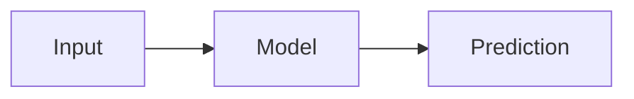

# Blog Authoring Knowledgebase

This internal guide preserves the useful authoring patterns from the al-folio demo posts before removing those demo posts from the public site.

Use it when drafting, reviewing, or converting blog posts for Selcuk Senturk's site. Keep changes in starter-owned content paths such as `_posts`, `_projects`, `_news`, `_data`, and `_config.yml`. Do not copy or patch plugin-owned layouts, includes, Sass, or JavaScript for routine content work.

## Site Voice

- Audience: AI/ML engineers, data scientists, software engineers, and computer science learners.
- Tone: practical, clear, technically serious, and approachable.
- Best post shape: explain the concept, motivate why it matters, show a concrete example, then give implementation details or next steps.
- Prefer original diagrams, code snippets, notebooks, or visuals over generic prose when explaining technical systems.

## Current Taxonomy

Use these public blog filters from `_config.yml`:

```yaml
display_tags: ["machine-learning", "data-science", "ai", "ml-systems", "ai-systems", "intelligent-systems", "cs-fundamentals"]
display_categories: ["artificial-intelligence", "machine-learning", "data-science", "computer-science"]
```

Recommended usage:

- `categories` should be broad: `artificial-intelligence`, `machine-learning`, `data-science`, or `computer-science`.
- `tags` should be specific: `rag`, `agents`, `computer-vision`, `time-series`, `ml-systems`, `cs-fundamentals`, etc.
- Prefer hyphenated lowercase tags and categories for stable URLs.

## Standard Post Template

Use this for most posts:

```markdown
---
layout: post
title: "Clear, Specific Title"
date: 2026-06-20 09:00:00+0300
description: One sentence explaining what the reader will learn.
tags: machine-learning ml-systems
categories: machine-learning
giscus_comments: true
related_posts: true
toc:
  beginning: true
---

Short hook: what problem are we solving and why does it matter?

## Core Idea

Explain the main concept in plain language.

## Example

Show a small example, diagram, code snippet, or workflow.

## Implementation Notes

Give practical details, pitfalls, and tradeoffs.

## Conclusion

Summarize what the reader should remember.
```

Notes:

- `layout: post` is the default for standard blog posts.
- Use timezone `+0300` for Istanbul when setting dates manually.
- Use `giscus_comments: true` when discussion is useful.
- Use `related_posts: false` for short posts or posts that should stand alone.
- Use `featured: true` sparingly for posts that should be highlighted.

## Table Of Contents

To show an automatic table of contents near the beginning:

```yaml
toc:
  beginning: true
```

For a sidebar table of contents:

```yaml
toc:
  sidebar: left
```

Use headings consistently:

```markdown
## Main Section

### Subsection
```

Avoid skipping heading levels.

## Code Blocks

Use fenced code blocks with language identifiers:

````markdown
```python
def predict(x):
    return model(x)
```
````

For line numbers in a specific block, use Liquid highlight:

```liquid

def train(model, dataloader):
    pass

```

For diffs, prefer `diff2html` when readability matters:

````markdown
```diff2html
diff --git a/app.py b/app.py
--- a/app.py
+++ b/app.py
@@ -1 +1 @@
-old_value = 1
+new_value = 2
```
````

When a post contains Diff2Html blocks, add:

```yaml
code_diff: true
```

## Math And Algorithms

Inline math:

```markdown
The loss is $L(y, \hat{y})$.
```

Display math:

```markdown
$$
L = -\sum_i y_i \log(\hat{y_i})
$$
```

For pseudocode blocks, add:

```yaml
pseudocode: true
```

Then use:

````markdown
```pseudocode
\begin{algorithm}
\caption{Training loop}
\begin{algorithmic}
\STATE Initialize model
\FOR{batch in data}
\STATE Update parameters
\ENDFOR
\end{algorithmic}
\end{algorithm}
```
````

In pseudocode examples, use `$$` where pseudocode.js expects math delimiters.

## Diagrams

For Mermaid diagrams, add:

```yaml
mermaid:
  enabled: true
  zoomable: true
```

Then use:

````markdown

````

For TikZ diagrams, add:

```yaml
tikzjax: true
```

Use TikZ when porting LaTeX-style diagrams from notes or papers.

For typograms, use them only when an ASCII-style diagram is clearer than prose.

## Images

Add a post thumbnail with:

```yaml
thumbnail: assets/img/example.jpg
```

Use al-folio's figure include:

```liquid

```

For a responsive row:

```html
<div class="row mt-3">
  <div class="col-sm mt-3 mt-md-0">
    
  </div>
  <div class="col-sm mt-3 mt-md-0">
    
  </div>
</div>
<div class="caption">
  Short, useful caption.
</div>
```

Recommendations:

- Use real diagrams or screenshots for technical posts.
- Keep captions explanatory.
- Avoid relying on demo images such as `assets/img/1.jpg` unless intentionally replaced.

## Galleries And Advanced Images

The demo posts showed several gallery/lightbox options. Use these only when a post benefits from multiple related visuals.

Common front matter:

```yaml
thumbnail: assets/img/example.jpg
images:
  slider: true
```

For most technical posts, a simple image row or a single zoomable figure is enough.

## Audio And Video

Local or remote audio:

```liquid

```

Video:

```liquid

```

Embedded YouTube/Vimeo-style URLs can also be used with `video.liquid`.

Use media only when it adds real explanation, such as a demo of a model, UI, or system behavior.

## Tables

Markdown tables work for small static content:

```markdown
| Metric | Value |
| --- | ---: |
| Accuracy | 0.92 |
| Latency | 35 ms |
```

For larger, sortable, or interactive tables, the demo posts used HTML tables and JSON data. Prefer simple Markdown until interactivity is clearly useful.

## Charts And Maps

For charts, add a `chart` front matter section. The demo posts covered Chart.js, ECharts, Vega-Lite, Plotly, and GeoJSON/Leaflet maps.

Use charts when the post has real data to inspect. Recommended pattern:

```yaml
chart:
  chartjs: true
```

Then include the chart code in the body using the relevant block style shown by the original al-folio examples.

For maps, use GeoJSON only when geographic context matters.

## Jupyter Notebooks

Use notebooks for exploratory ML/data science posts when readers benefit from seeing computations.

Pattern:

```liquid


```

If checking file existence, use the `file_exists` filter before rendering the notebook.

Recommendation: convert long notebooks into narrative posts with selected code/output, rather than dumping every cell.

## Tabs

For tabbed content, add:

```yaml
tabs: true
```

Then use:

```liquid



Python content here.



YAML content here.



```

Use tabs for alternative implementations, configuration variants, or before/after comparisons.

## Bibliography And Citations

For regular posts with references:

```markdown
This idea is related to .
```

Multiple citations:

```markdown
See .
```

Reference details:

```markdown

```

Quote block from bibliography:

```liquid

Quoted text here.

```

Use `related_publications: true` when a post should connect to publications.

## Distill Posts

Use `layout: distill` for research-style, article-like posts that need Distill-specific features, such as margin notes, appendix bibliography, and richer scientific presentation.

Minimal front matter:

```yaml
---
layout: distill
title: "Research-Style Post"
description: Short summary.
date: 2026-06-20
tags: ai ml-systems
giscus_comments: true
bibliography: post-specific.bib
toc:
  - name: Section
---
```

Distill citations use tags such as:

```html
<d-cite key="paper_key"></d-cite>
```

Use Distill only when it improves the reading experience. For most posts, `layout: post` is simpler and better.

## Project Pages

Project files live in `_projects`.

Template:

```markdown
---
layout: page
title: Project Title
description: One sentence summary.
img: assets/img/project-image.jpg
importance: 1
category: AI/ML
giscus_comments: true
---

## Overview

What the project does and why it matters.

## Technical Approach

Stack, methods, architecture, and tradeoffs.

## Results

Metrics, screenshots, demos, or links.

## Links

- [GitHub Repository](https://github.com/selcuksntrk/example)
```

Notes:

- `importance` controls sort order, lower comes first.
- `category` should match `_pages/projects.md` display categories.
- `redirect:` can point a project card to an external page, but prefer a local project page for portfolio storytelling.

## News And Announcements

News files live in `_news`.

Inline announcement:

```markdown
---
layout: post
date: 2026-06-20 09:00:00+0300
inline: true
related_posts: false
---

Short announcement text.
```

Full announcement:

```markdown
---
layout: post
title: Announcement Title
date: 2026-06-20 09:00:00+0300
inline: false
related_posts: false
---

Longer announcement body.
```

Use news for real milestones: new role, new project, publication, talk, certification, or site launch.

## Writing Checklist

Before publishing:

- Title is specific and not clickbait.
- Description explains the value in one sentence.
- Tags and categories match the site taxonomy.
- Date and timezone are correct.
- TOC is enabled for long posts.
- Comments are enabled only when discussion is useful.
- Code blocks have language identifiers.
- Images have useful captions and stable local paths.
- External links are relevant.
- No demo images, demo repos, or placeholder text remain.

## Demo Source Files

This guide was distilled from the starter demo posts that may be removed from the public blog:

- Formatting, links, images, code, math, tables, TOC, sidebar TOC, blockquotes, tabs
- Comments, external embeds, bibliography, citations, citeable posts
- Jupyter notebooks, diagrams, TikZ, typograms, pseudocode
- Chart.js, ECharts, Vega-Lite, Plotly, GeoJSON/Leaflet
- Distill-style post examples
- Demo project and news files

Keep this guide as the private reference instead of keeping demo posts live on the site.
